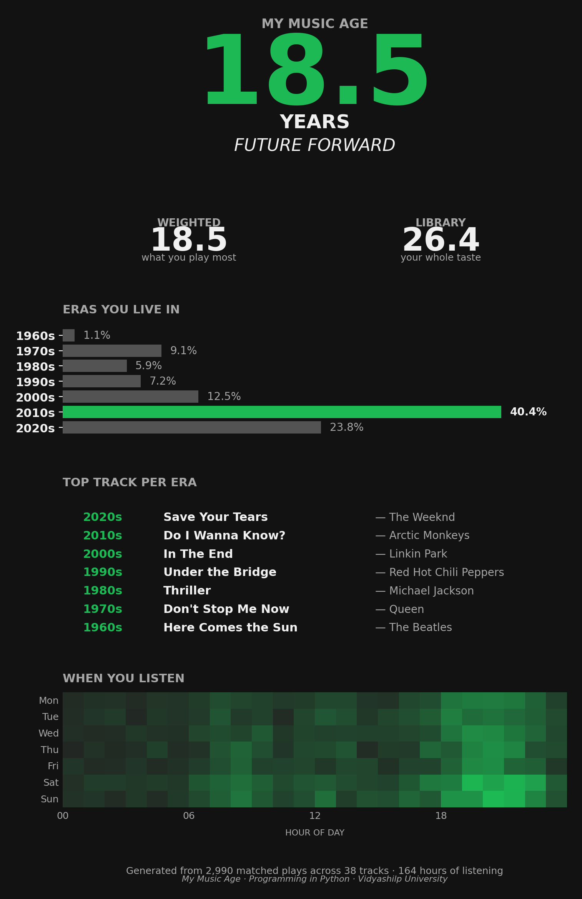

# 🎧 My Music Age

> A personalised listening-era report generator for Spotify users. Discover what decade your taste lives in, get your "Music Age" in years, and see your listening patterns visualised in a Spotify Wrapped-style poster.



## What is "Music Age"?

Spotify Wrapped tells you *what* you played most last year. **My Music Age** tells you *when* the music you play was made — and turns it into a single shareable number.

Two metrics are computed from your listening history:

- **Weighted Music Age** — the average release year of the songs you actually listen to, weighted by play count. This is "how old is the music in your daily rotation?"
- **Library Music Age** — each unique song counted once. This is "how old is your taste, in breadth?"

If the two numbers diverge, you have a story: maybe you own a lot of oldies but mostly play recent hits. Or vice versa.

You also get an **era profile label** — "Decade Hopper", "2010s Loyalist", "Future Forward", "Vintage Soul", or "Balanced Listener" — based on how your listening time distributes across decades.

## How it works

```
Spotify export (.json)
        ↓
   parse + clean       ← Stage 2
        ↓
  enrich with Kaggle   ← Stage 3
   1M-track catalogue
        ↓
   Music Age math      ← Stage 3
        ↓
   render poster       ← Stage 4
        ↓
  interactive UI       ← Stage 5
```

Five small modules, each one with its own notebook and README, that compose into a single end-to-end tool.

## Project structure

| Folder | Purpose |
|---|---|
| `synopsis/` | Project synopsis (Word document, 9 sections) |
| `stage2/` | Data pipeline: load + clean Spotify JSON |
| `stage3/` | Catalogue join + Music Age computation |
| `stage4/` | Wrapped-style poster rendering |
| `stage5/` | Interactive entry point (`run()` + `interactive()`) |
| `catalogue/` | Spotify catalogue from Kaggle (gitignored, ~167 MB; download instructions below) |

Each stage folder has a `README.md` explaining what was built and which course concepts (Modules 1–3 of the syllabus) were applied.

## Quick start

### 1. Clone and install

```bash
git clone https://github.com/samarrthyayrapatwar-alt/my-music-age.git
cd my-music-age
pip install -r requirements.txt
```

### 2. Download the Kaggle catalogue (one-time, ~167 MB)

The Spotify catalogue (1.2 M tracks with release years) isn't tracked in git because of GitHub's 100 MB file-size limit. Download it once with:

```bash
# Set up Kaggle CLI (need a free Kaggle account → Settings → API → Create New Token)
export KAGGLE_API_TOKEN="KGAT_your_token_here"

mkdir -p catalogue
kaggle datasets download amitanshjoshi/spotify-1million-tracks -p catalogue --unzip
```

### 3. Try it with sample data

```bash
cd stage5
python3 app.py
```

You should see step-by-step output ending with a `my_music_age_poster.png` saved to the folder.

### 4. Use your own Spotify data

1. Visit https://www.spotify.com/account/privacy/
2. Scroll to "Download your data" → click **Request**
3. Wait 1–30 days for the email
4. Unzip and copy the `StreamingHistory_music_*.json` files into `stage5/`
5. Run:

```python
from app import run
run("StreamingHistory_music_0.json")
```

## Tech stack

| Library | What it does in this project | Course module |
|---|---|---|
| `pandas` | DataFrames, merging, groupby aggregations | Module 2 |
| `numpy` | Weighted mean for Music Age calculation | Module 2 |
| `matplotlib` | Multi-panel poster, bar charts, text | Module 3 |
| `seaborn` | Heatmap with `dark_palette` | Module 3 |
| `json`, `pathlib` | File handling | Module 1 |

No frameworks. No web servers. No outside-syllabus libraries. Every line is something taught in the *Programming in Python* course.

## Limitations

- Spotify's basic data export covers only the last 12 months
- Catalogue match rate is typically 75–95% — obscure or regional tracks may be excluded from Music Age computation
- Remasters can carry a modern release year, slightly skewing Music Age younger than reality
- The era profile classifier is rule-based — descriptive, not predictive

See `synopsis/My_Music_Age_Synopsis.docx` for the full limitations and future-enhancement list.

## Author

**Samarrthya Rapatwar** (2025UG000383)
School of Computational and Data Sciences, Vidyashilp University
*Programming in Python — Semester II Project*

## License

MIT — see `LICENSE` for details.
